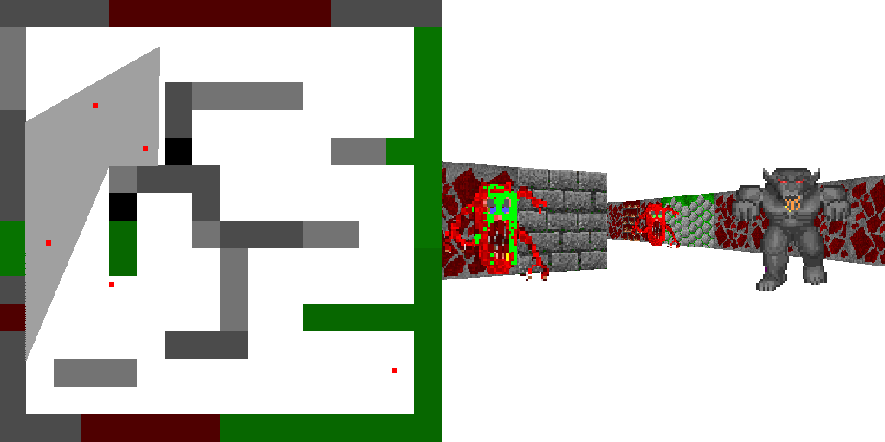

# tinyraycaster in plain C | ([Readme RU](README_ru.md))

This raycaster implementation is based on Dmitry V. Sokolov's (aka “ssloy") tutorial “Project based learning: build your own 3D shooter in a weekend" (original [repository](https://github.com/ssloy/tinyraycaster)).

Differences from the original:

* Using SDL3 instead SDL2

* The source code is rewritten in plain C (C11 standart).

* For the convenience of processing and displaying the text of SDL3 errors, functional macros have been added with the ability to set a flag to terminate the application. For more information, see [lecture](https://rutube.ru/video/437ec1cc186ac3222b32dd4730a9ec61/?t=395&r=plwd) “The practice of the C language (MIPT, 2023-2024). SDL addition and visualization” by Konstantin Vladimirov.

* Other differences related to the lack of separate C\+\+ features in C.



## Build project

NOTE: before building, you need to install SDL3.

```sh
git clone https://github.com/m-anvl/tinyraycaster_in_plain_c.git
cd tinyraycaster_in_plain_c
mkdir build
cd build
cmake ..
```

Open the project in an IDE or another tool.